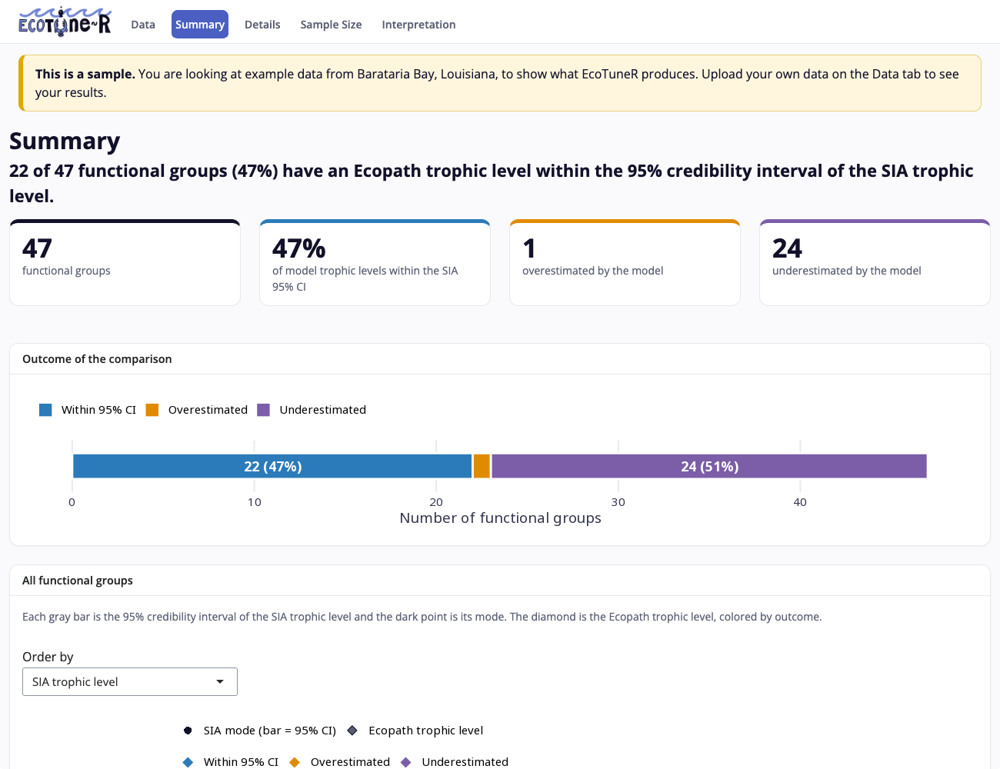
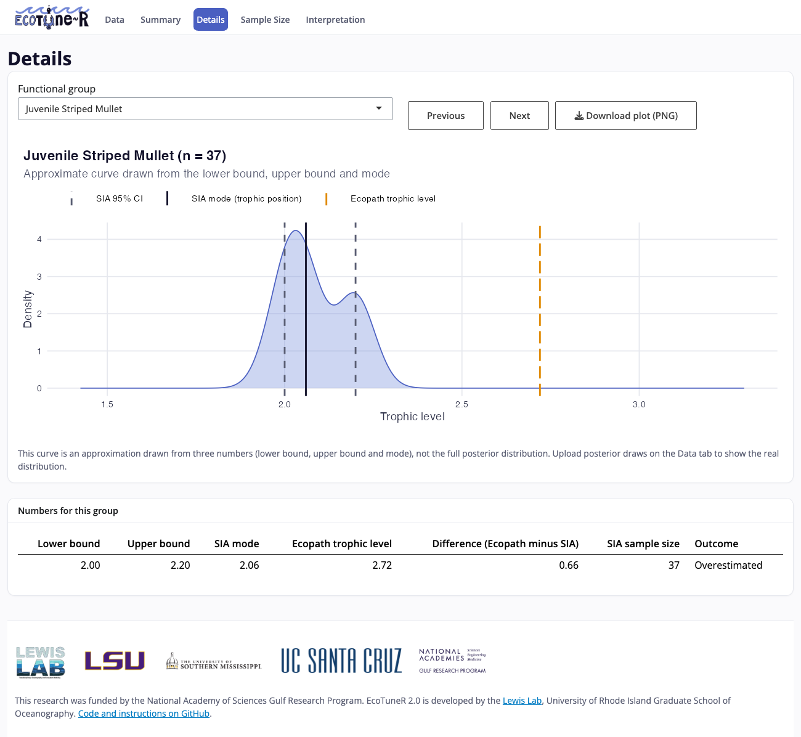

# EcoTuneR

**EcoTuneR** is an open-source R Shiny tool for comparing food web model trophic levels with trophic levels estimated from stable isotope analysis (SIA) using a Bayesian model. It was developed to support the validation of Ecopath with Ecosim (EwE) food web models with stable isotope data, and shows how well the two approaches agree for every functional group.

## See a live sample

**[Open a sample of EcoTuneR in your browser](https://lewislab-uri.github.io/EcoTuneR/?example=1)**

The link opens the tool with example data already loaded. **This is just a sample**: it uses the Barataria Bay, Louisiana dataset from the paper below to show what EcoTuneR produces. Nothing needs to be installed. The first load can take up to half a minute.

[](https://lewislab-uri.github.io/EcoTuneR/?example=1)

To use your own data, open [EcoTuneR in your browser](https://lewislab-uri.github.io/EcoTuneR/) and upload a CSV file, or run it in R (below). Uploaded files stay on your computer; the browser version runs R inside your browser and sends nothing to a server.

EcoTuneR was developed by the [Lewis Lab at the University of Rhode Island Graduate School of Oceanography](https://web.uri.edu/lewis-lab/) and is described in:

> Lewis et al. (*in review*). Bayesian stable isotope analysis as a validation approach for marine food web models: a coastal Louisiana, USA case study. *Ecosphere*.

---

## What it shows

| Tab | Description |
|-----|-------------|
| **Data** | Upload a CSV file or load the example. EcoTuneR checks the table and reports anything it cannot use (text in a number column, a lower bound above its upper bound, repeated names). |
| **Summary** | How many functional groups have an EwE trophic level within, above or below the 95% credibility interval of the SIA trophic level; a chart of every group's interval, SIA mode and EwE trophic level; and a results table. Click a group to open it on the Details tab. |
| **Details** | A distribution plot for each functional group with the 95% credibility interval, the SIA mode and the EwE trophic level. |
| **Sample Size** | Optional. If SIA sample size is supplied as a 6th column, plots the 95% credibility interval range of each functional group against its sample size, fits a power function decay curve (CI range = a × n^b), and flags functional groups whose credibility interval range deviates from the curve by more than 2 median absolute deviations on the log scale (e.g., a well-sampled group with an unexpectedly wide interval). |
| **Interpretation** | Questions to help explain agreement or disagreement between the two methods (e.g., detritus-based diets, tissue integration time, temporal mismatches). |

A report (one HTML file with the summary, every group's plot and the results table) and the results table (CSV) can be downloaded from the Summary tab.



---

## Input data format

EcoTuneR needs a table with **5 columns in the following order**, plus an optional 6th column:

| Column | Name | Description |
|--------|------|-------------|
| 1 | Consumer | Functional group or species name |
| 2 | Lower bound | Lower bound of the 95% Bayesian credibility interval for the SIA-derived trophic level |
| 3 | Upper bound | Upper bound of the 95% Bayesian credibility interval for the SIA-derived trophic level |
| 4 | SIA mode / trophic position | Modal value of the Bayesian posterior distribution (the point estimate for the SIA-derived trophic level) |
| 5 | Ecopath trophic level | Trophic level from the EwE food web model (leave empty or `NA` if not available for a group) |
| 6 | SIA sample size (optional) | Number of stable isotope samples for the functional group. Only needed for the Sample Size tab |

Column names do not need to match. Columns are read by position, and the Data tab lets you reassign them if your file is in a different order.

```
Consumer,Lower,Upper,SIA_Mode,EwE_TL,n
Adult Spot,2,9.21,3.7,2.32,1
Juvenile Shark,2.03,7.11,4.05,3.44,2
Adult Blue Catfish,2.57,4.56,3.52,2.95,3
...
```

The example file, [`Example Datasets/Example_combined_output.csv`](Example%20Datasets/Example_combined_output.csv), holds the 47 functional groups from the coastal Louisiana case study and can be used as a template.

These values are typically produced by running the [tRophicPosition](https://github.com/clquezada/tRophicPosition) Bayesian model (Quezada-Romegialli et al., 2018) on your stable isotope data and combining the results with the trophic levels from your EwE model.

### Optional: posterior draws

With only the table above, each group's curve on the Details tab is an **approximation** drawn from three numbers (lower bound, upper bound and mode). To show the real posterior distribution, also supply the posterior draws from your Bayesian model as a second CSV file with two columns: the consumer name (matching the main table), then one trophic position draw per row.

```
Consumer,TP
Adult Spot,3.61
Adult Spot,3.74
...
```

---

## Running EcoTuneR in R

EcoTuneR needs R (version 4.0 or later) and three packages:

```r
install.packages(c("shiny", "bslib", "ggplot2"))
```

Then source it from GitHub:

```r
source('https://raw.githubusercontent.com/LewisLab-URI/EcoTuneR/main/EcoTuneR.R')

# Open the app and upload a CSV file or load the example
ecotuneR()

# Or open the app with a data frame you have already loaded
combined_output <- read.csv("your_combined_output.csv")
ecotuneR(combined_output)

# Or open the sample
ecotuneR(example = TRUE)
```

### Function arguments

```r
ecotuneR(combined_output = NULL, export = FALSE, bypass_check = FALSE, posterior = NULL, example = FALSE)
```

| Argument | Type | Default | Description |
|----------|------|---------|-------------|
| `combined_output` | data frame | none | Input table in the format described above. Leave empty to upload a file in the app |
| `export` | logical | `FALSE` | If `TRUE`, writes a report and plots to a folder instead of opening the app |
| `bypass_check` | logical | `FALSE` | Kept so that scripts written for version 1 still run. The data checks no longer open a dialog |
| `posterior` | data frame | none | Optional posterior draws (consumer, trophic position) |
| `example` | logical | `FALSE` | If `TRUE`, opens the app with the example data loaded |

### Export mode

```r
ecotuneR(combined_output, export = TRUE)
```

This creates a folder called `Exported Results of combined_output/` in your working directory containing:
- `A Summary of combined_output.html`: a report with the summary, the chart of all groups and the results table
- `Results Table.csv`
- `Summary Plot.png` and `Overview Plot.png`
- One `.png` distribution plot per functional group
- `Sample Size Plot.png` and `Sample Size Flags.csv` (only if a sample size column was supplied)

---

## Interpreting results

EcoTuneR places each functional group in one of three outcomes:

- **Within 95% CI**: the EwE trophic level falls within the Bayesian credibility interval. The two methods agree for this group.
- **Overestimated**: the EwE trophic level falls *above* the upper bound of the credibility interval. The model assigns a higher trophic level than the stable isotope data support.
- **Underestimated**: the EwE trophic level falls *below* the lower bound of the credibility interval. The model assigns a lower trophic level than the stable isotope data support.

Groups with no EwE trophic level are listed separately.

The **Interpretation** tab gives questions to guide the reading of disagreements, including:
- Whether the species relies heavily on detritus (EwE assigns detritus a trophic level of 1, which commonly causes underestimation)
- Tissue type and the time window the SIA samples integrate
- Whether the SIA and EwE data were collected in the same period
- Seasonal mismatches in data collection

---

## Versions

- **2.0**: redesigned interface; file upload and data checks in the app; browser version; chart of all functional groups; Sample Size tab; optional posterior draws; example data from the Louisiana case study.
- **1.0**: the original tool, kept under the [`v1.0` tag](https://github.com/LewisLab-URI/EcoTuneR/tree/v1.0).

---

## Citation

If you use EcoTuneR in your research, please cite:

> Lewis et al. (*in review*). Bayesian stable isotope analysis as a validation approach for marine food web models: a coastal Louisiana, USA case study. *Ecosphere*.

And the software it depends on:

> Quezada-Romegialli, C., Jackson, A.L., Hayden, B., Kahilainen, K.K., Lopes, C., Harrod, C. (2018). tRophicPosition, an R package for the Bayesian estimation of trophic position from consumer stable isotope ratios. *Methods in Ecology and Evolution*, 9(6), 1592–1599.

> Wickham, H. (2016). *ggplot2: Elegant Graphics for Data Analysis*. Springer-Verlag New York.

> Chang, W., Cheng, J., Allaire, J., et al. shiny: Web Application Framework for R.

> Sievert, C., Cheng, J., Aden-Buie, G. bslib: Custom 'Bootstrap' 'Sass' Themes for 'shiny' and 'rmarkdown'.

---

## Funding

This research was funded by the National Academy of Sciences Gulf Research Program.

---

## Contact

For questions or issues, please open a GitHub Issue or contact the Lewis Lab at the University of Rhode Island Graduate School of Oceanography:
[https://web.uri.edu/lewis-lab/](https://web.uri.edu/lewis-lab/)
